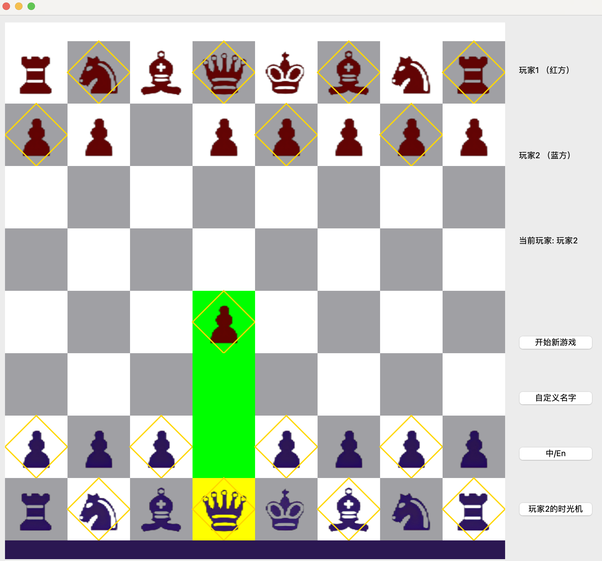

# Qt LabChess

基于Steam游戏"Time Chess Demo"开发的国际象棋游戏，使用Qt 6.7.3实现核心功能。



## 功能特点

- 国际象棋主要规则实现
- 时光回溯和时间子实现
- 现代化的Qt界面
- 走子提示

## 安装说明

### 系统要求
- macOS
- Qt 6.7.3 或更高版本


### 安装步骤

1. 克隆仓库

```bash
git clone https://github.com/ziegel-thu/Qt-LabChess.git

cd Qt-LabChess
```

2. 安装Qt

3. 编译项目

```bash
qmake 

make
```

或使用VSCode：
- 打开项目文件夹
- 使用 `.vscode/tasks.json` 中的构建任务进行编译

4. 运行


/build/qt-labchess.app

### macOS用户注意事项
由于未包含Apple官方许可证，暂时需要自行编译才能运行

## 使用说明
1. 运行应用程序 `/build/qt-labchess.app`
2. 点击"开始新游戏"按钮开始对局
3. 点击“中/En”切换语言
4. 点击“自定义昵称”按钮设置昵称

### 游戏说明
1. 顶部和底部的颜色条，以及右侧的玩家信息指示当前回合玩家
2. 点击棋子可移动位置走棋，选中的棋子和可走的位置会有黄色和绿色的指示
3. 点击“玩家名字+的时光机”按钮时光回溯，每个玩家有一次时光回溯机会
   - 点击“回退”退回上一步操作
   - 点击“前进”前进到已经查看过的下一步操作
   - 点击“放弃”按钮放弃时光回溯
   - 点击“确认”按钮确认时光回溯

## 开发相关

### 项目结构

qt-labchess/
- pics/ 图片资源
- src/core/ 核心源代码
- src/ui/ 界面源代码
- src/tests/ 测试源代码及测试编译文件
- src/main.cpp 主函数
- build/ 编译文件
- qt-labchess.pro 项目文件
- README.md 说明文件
- .vscode/ 开发工具配置
- 还有一些实验报告的文件

## 贡献指南

我们非常欢迎社区贡献！以下是参与项目的指南：

### 提交 Pull Request
1. Fork 本仓库到您的 GitHub 账号
2. 克隆您的 Fork 仓库到本地   ```bash
   git clone https://github.com/您的用户名/Qt-LabChess.git   ```
3. 创建新的分支   ```bash
   git checkout -b feature/您的特性名称   ```
4. 提交您的修改   ```bash
   git commit -m "描述您的修改"   ```
5. 推送到您的 Fork   ```bash
   git push origin feature/您的特性名称   ```
6. 通过 GitHub 创建 Pull Request

### 代码规范
- 使用 4 空格缩进
- 类名使用大驼峰命名（如 ChessBoard）
- 方法名使用小驼峰命名（如 movePiece）
- 变量名使用小驼峰命名（如 playerName）
- 添加必要的注释，尤其是复杂逻辑部分
- 遵循 Qt 编码规范

### 提交测试
- 为新功能编写单元测试
- 确保所有测试通过
- 测试文件放在 `src/tests/` 目录下

### 文档更新
- 更新 README.md（如有必要）
- 添加新功能的使用说明
- 更新注释和文档字符串

### Issue 提交
- 使用 Issue 模板
- 清晰描述问题或建议
- 提供复现步骤（如果是 bug）
- 标注相关标签
## 开源协议
MIT License

## 作者

Ziegel

zhengsr23@mails.tsinghua.edu.cn

zhengshurui0627@gmail.com

## 致谢

- 感谢 Time Chess Demo 的创意启发
- 感谢Qt 框架
- Cursor，Claude，ChatGPT，Copilot
- 感谢清华大学马昱春老师和助教，同学们的帮助和支持

## 项目状态

持续开发中 - 欢迎贡献！